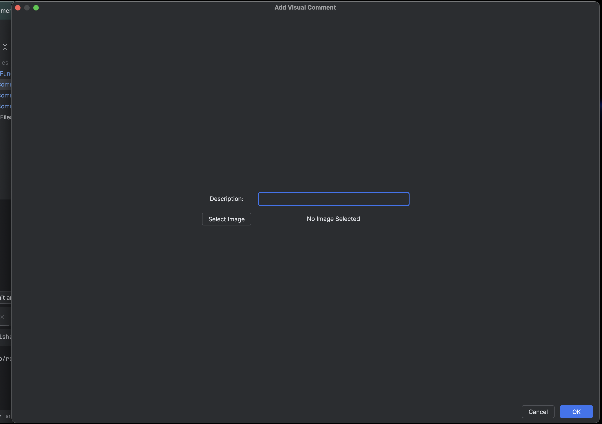
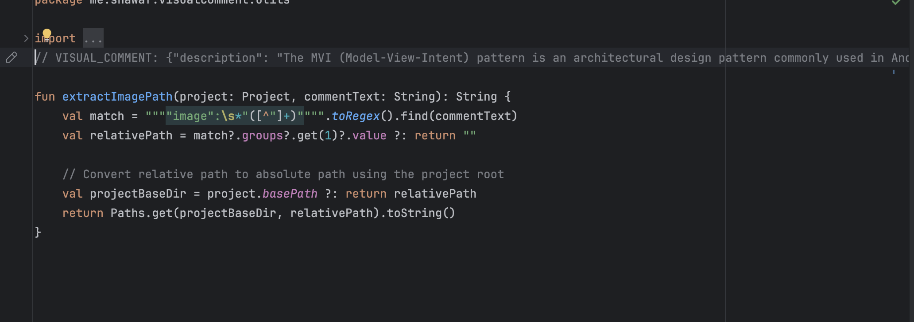
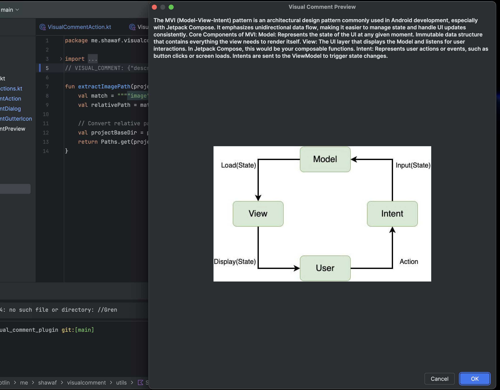

# Visual Comment Plugin for Android Studio

**Visual Comment** is an Android Studio plugin that allows developers to add rich, visual comments with images and descriptions directly in their code. With intuitive UI elements, gutter icons, and dynamic previews, this plugin enhances code readability and collaboration.

---

## 📅 **Features**

- 📷 **Visual Comments with Images**: Add comments that include images and detailed descriptions.
- 🔧 **Intuitive Wizard**: Easily upload images and add descriptions through a user-friendly dialog.
- 🌎 **Project-Scoped Image Storage**: Automatically save images inside your project’s `visualized-comments/` folder.
- 📌 **Gutter Icon Integration**: Special icons appear next to visual comments for quick access.
- 👁️ **Dynamic Previews**: Click on visual comments to view an organized preview with scaled images and formatted text.
- 🔄 **Cross-Device Compatibility**: Comments and images are saved relative to the project folder, ensuring they work on any device.

---

## 🖼️ **Screenshots**

### 1. **Add Visual Comment Wizard**  
*Easily upload images and enter descriptions.*  


### 2. **Gutter Icon Beside Comment**  
*Quickly access visual comments using gutter icons.*  


### 3. **Preview Comment with Image & Description**  
*View comments in a formatted preview window.*  


---

## 🛠️ **Tools & Technologies Used**

- 🚀 **IntelliJ Platform Version 2024.1** (Compatible with Android Studio Iguana): Built on the IntelliJ Platform for seamless integration.
- 📄 **Kotlin 1.9.10**: Leveraged Kotlin for clean, concise, and robust plugin development.
- 📝 ***Gradle IntelliJ Plugin 1.15.0**: Simplified building and deployment.
- 🌐 **JetBrains Marketplace**: Published and managed through the official JetBrains Marketplace.
  
---

## 🔄 **Upcoming Features**

- [ ] **Custom Save Location**: Choose where to save images.
- [ ] **Display UI Enhancement**: Enhance Display POPUP UI. 
- [ ] **Export & Share Visual Comments**: Export comments with images to share with teammates.
- [ ] **Searchable Visual Comments**: Quickly find visual comments using keywords.
- [ ] **Dark Mode Support**: Enhanced UI for better readability in dark themes.
- [ ] **Cloud Sync**: Synchronize visual comments across multiple devices and repositories.

---

## 🔒 **License**

```text
Apache License 2.0

Copyright 2024 Mohamed El Shawaf

Licensed under the Apache License, Version 2.0 (the "License");
you may not use this file except in compliance with the License.
You may obtain a copy of the License at

    http://www.apache.org/licenses/LICENSE-2.0

Unless required by applicable law or agreed to in writing, software
distributed under the License is distributed on an "AS IS" BASIS,
WITHOUT WARRANTIES OR CONDITIONS OF ANY KIND, either express or implied.
See the License for the specific language governing permissions and
limitations under the License.
```

---

## 📢 **Contributing**

Contributions are welcome! Feel free to fork the repository, submit issues, or create pull requests to improve the plugin.

---

## 🌐 **Connect with Me**

- **Website**: [shawaf.me](https://shawaf.me)
- **Email**: [mohamed.elshawaf.1@gmail.com](mailto:mohamed.elshawaf.1@gmail.com)
- **JetBrains Marketplace**: [Visualized Comments Plugin](https://plugins.jetbrains.com/plugin/26499-visual-comment)

---

Thank you for using the **Visual Comment** plugin! 🚀 Let me know your feedback and suggestions!

